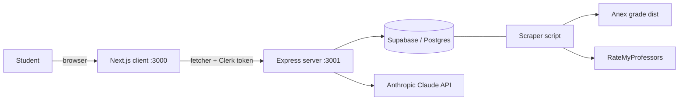

Sift is a monorepo with two independent packages: `client/` (Next.js) and `server/` (Express), run concurrently via `make dev`. They communicate over HTTP, with Clerk handling auth on both sides.

## High-level flow

## Client

Next.js 16 App Router with React 19, TypeScript, Tailwind v4, shadcn/ui, and TanStack Query.

- **API client** — `client/src/lib/api.ts` exposes `fetcher()` which adds the Clerk auth token to every request and returns `{ data: T | null, error: string | null }`. `API_BASE` is exported from this file — never duplicate it.
- **Query hooks** — `client/src/lib/queries.ts` wraps each API function in a TanStack Query hook with 5min `staleTime`, 1 retry, and `refetchOnWindowFocus` disabled.
- **Auth tokens** — `client/src/lib/auth-token.ts` reads the Clerk session token before each request.
- **Types** — `client/src/lib/types.ts` mirrors `server/src/types/index.ts`. **Keep them in sync manually.**

## Server

Express on TypeScript with `tsx` for dev.

- **Routes** — `server/src/routes/*.ts`. Each file exports a router; routers are mounted in `server/src/index.ts`.
- **Services** — shared business logic lives in `server/src/services/`:
  - `scoring.ts` — weighted score for (course, professor) combos
  - `requirements.ts` — remaining-requirements computation; handles equivalency mapping
  - `workload.ts` — killer-combo detection (hardcoded CSCE pairings \+ heuristic)
  - `prereq-graph.ts` — DAG over `courses.prereqs` with topological sort \+ critical-path
  - `solver.ts` — greedy multi-semester plan generator (4 passes, different objectives)
- **Middleware** — `server/src/middleware/auth.ts` exposes `requireAuth` which extracts `userId` from Clerk's `clerkMiddleware()` for protected endpoints.

## Data layer

- **Supabase / Postgres** with `pgvector` reserved for future RAG.
- Core tables: `courses`, `sections`, `professors`, `grade_distributions`, `degree_plans`, `users`, `semester_plans`.
- Migrations live in `supabase/migrations/`.
- Data is populated by `server/scripts/scrape.ts` — Anex (grade distributions) \+ RateMyProfessors (ratings).

## API contract

Every endpoint returns `{ data, error }`. See [API Reference](/api-reference/introduction) for the full surface.

## Conventions

- **Tailwind v4** uses `@theme inline` in `globals.css` (no `tailwind.config.ts`).
- **Color tokens** — `sift-amber` (maroon primary), `sift-green`, `sift-red`, `sift-blue`, `sift-purple`, `sift-surface`, `sift-surface-raised`.
- **`font-mono`** is reserved for data (course codes, GPA, percentages, credits) — never for labels, headings, or body text.
- **Grade distributions** are stored as decimals (0–1) and rendered as percentages in the UI.
- **Completed courses** live in `localStorage` (`sift_completed_courses`) for unauthenticated browsing, with a migration path to the user profile after sign-in.
- **Server vs. client components** — prefer server components; only opt into client components when you need interactivity. The dev server uses the `--webpack` flag.
- **Loading states** — every route has a `loading.tsx` Suspense boundary. A `NavProgress` bar (`client/src/components/nav-progress.tsx`) animates during route transitions.
- **User-facing errors must be friendly** — never expose raw API errors, port numbers, or "make sure the backend is running" messages.